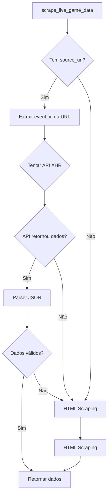

# 🎯 API de Eventos Individuais - Jogos ao Vivo

## 📋 Resumo

Foi implementado suporte para buscar dados de eventos individuais (especialmente jogos ao vivo) diretamente via API XHR da BetNacional, tornando o monitoramento muito mais eficiente.

## 🔍 Como Funciona

### URL Pattern
As URLs de eventos individuais seguem o padrão:
```
https://betnacional.bet.br/event/{sport_id}/{live_flag}/{event_id}
```

**Exemplo:**
- `https://betnacional.bet.br/event/1/1/62155186`
  - `sport_id = 1` (Futebol)
  - `live_flag = 1` (Jogo ao vivo)
  - `event_id = 62155186` (ID do evento)

### API Endpoint

A API XHR usa o endpoint:
```
https://prod-global-bff-events.bet6.com.br/api/event-odds/{event_id}
```

**Parâmetros:**
- `languageId`: ID do idioma (1 = português)
- `marketIds`: IDs dos mercados (vazio = todos)
- `outcomeIds`: IDs dos outcomes (vazio = todos)
- `statusId`: ID do status (1 = ativo)

### Resposta da API

A API retorna um JSON com estrutura:
```json
{
  "events": [
    {
      "id": 62155186,
      "event_id": 62155186,
      "sport_id": 1,
      "home": "Egnatia Rrogozhine",
      "away": "KF Vllaznia Shkoder",
      "event_status_id": 1,
      "date_start": "2025-11-04 12:00:00",
      "tournament_name": "1ª Divisão",
      "odds": [
        {
          "id": "62155186_1_1_",
          "market_id": 1,
          "outcome_id": "1",
          "odd": "12.000",
          ...
        },
        {
          "id": "62155186_1_2_",
          "market_id": 1,
          "outcome_id": "2",
          "odd": "3.700",
          ...
        },
        {
          "id": "62155186_1_3_",
          "market_id": 1,
          "outcome_id": "3",
          "odd": "1.350",
          ...
        },
        ...
      ]
    }
  ]
}
```

**Observações:**
- Cada evento tem um array `odds` com todas as odds disponíveis
- As odds são agrupadas por `market_id` (1 = Resultado Final 1x2)
- Cada odd tem um `outcome_id` (1=home, 2=draw, 3=away)

## 🛠️ Implementação

### Funções Criadas

#### 1. `extract_event_id_from_url(url: str)`
Extrai o `event_id` de uma URL de evento individual.

```python
event_id = extract_event_id_from_url("https://betnacional.bet.br/event/1/1/62155186")
# Retorna: 62155186
```

#### 2. `fetch_event_odds_from_api(event_id, language_id, status_id)`
Busca dados de um evento individual via API XHR.

```python
json_data = fetch_event_odds_from_api(
    event_id=62155186,
    language_id=1,
    status_id=1
)
```

#### 3. `parse_event_odds_from_api(json_data)`
Converte o JSON da API para o formato esperado pelo sistema.

```python
data = parse_event_odds_from_api(json_data)
# Retorna: {
#   "stats": {"event_id": 62155186, "home": "...", "away": "..."},
#   "markets": {"match_result": {"options": {"Casa": 12.0, "Empate": 3.7, "Fora": 1.35}}}
# }
```

#### 4. `fetch_event_odds_from_api_async(...)`
Versão assíncrona para uso em código assíncrono.

### Atualização da Função `scrape_live_game_data`

A função `scrape_live_game_data` agora:
1. **Tenta primeiro usar a API XHR** (se `source_url` fornecida)
2. **Faz fallback para HTML scraping** se a API falhar ou não retornar dados

**Assinatura atualizada:**
```python
def scrape_live_game_data(html: str, ext_id: str, source_url: str = None) -> Dict[str, Any]
```

## 📊 Vantagens da API XHR

### ✅ Performance
- **Muito mais rápido**: Não precisa renderizar HTML/JavaScript
- **Menos recursos**: Uma chamada API simples vs scraping completo
- **Dados atualizados**: API retorna dados em tempo real

### ✅ Confiabilidade
- **Dados estruturados**: JSON é mais confiável que parsing HTML
- **Menos frágil**: Não quebra se a estrutura HTML mudar
- **Todas as odds**: API retorna todos os mercados disponíveis

### ✅ Manutenibilidade
- **Código mais simples**: Menos parsing complexo
- **Fácil debug**: JSON é fácil de inspecionar
- **Fallback automático**: Se API falhar, usa HTML automaticamente

## 🔄 Fluxo de Execução



## 📝 Exemplo de Uso

```python
from scraping.betnacional import scrape_live_game_data

# Buscar dados de um jogo ao vivo
source_url = "https://betnacional.bet.br/event/1/1/62155186"
html = "<html>...</html>"  # HTML como fallback
ext_id = "62155186"

# A função tenta API primeiro, depois HTML
data = scrape_live_game_data(html, ext_id, source_url=source_url)

# Acessar dados
print(data["markets"]["match_result"]["options"])
# {'Casa': 12.0, 'Empate': 3.7, 'Fora': 1.35}
```

## 🔧 Integração Automática

A função está integrada automaticamente no sistema de monitoramento de jogos ao vivo:

```python
# Em scheduler/jobs.py - monitor_live_games_job()
source_url = game.game_url or game.source_link
html = await _fetch_requests_async(source_url)
live_data = scrape_live_game_data(html, game.ext_id, source_url=source_url)
```

O sistema automaticamente:
1. Detecta se é uma URL de evento individual
2. Extrai o `event_id`
3. Tenta usar a API primeiro
4. Faz fallback para HTML se necessário

## 📋 Mercados Suportados

Atualmente, o parser suporta:
- ✅ **Market ID 1**: Resultado Final (1x2) - Casa, Empate, Fora

**Mercados futuros podem ser adicionados:**
- Market ID 2: Ambos os Times Marcam (BTTS)
- Market ID 3: Total de Gols
- Market ID 4: Placar Exato
- Etc.

## 🐛 Troubleshooting

### API não retorna dados

Se a API não retornar dados, o sistema automaticamente faz fallback para HTML scraping. Isso pode acontecer se:

- A API estiver temporariamente indisponível
- O `event_id` estiver incorreto
- A estrutura da API mudou

### Logs

O sistema registra logs detalhados:

```
📡 Tentando buscar dados via API para evento 62155186
✅ Dados extraídos via API para evento 62155186
```

Se a API falhar:

```
⚠️  Erro ao buscar via API: ... Tentando HTML scraping...
🌐 Usando HTML scraping para evento 62155186
```

## 🔄 Compatibilidade

A implementação é **100% compatível** com o código existente:

- ✅ Parâmetro `source_url` é opcional (default=None)
- ✅ Fallback automático para HTML se API falhar
- ✅ Mesmo formato de retorno (Dict com stats e markets)
- ✅ Não quebra nenhuma funcionalidade existente

## 📚 Referências

- URL da API: `https://prod-global-bff-events.bet6.com.br/api/event-odds/{event_id}`
- Documentação da estrutura de dados: Ver `scraping/betnacional.py`
- Exemplo de resposta JSON: Ver arquivo `eventos ao vivo.txt`

---

**Última atualização:** Implementação inicial da integração com API de eventos individuais

