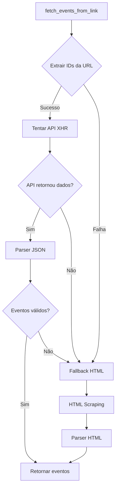

# 🚀 Integração com API XHR da BetNacional

## 📋 Resumo

A integração com a API XHR da BetNacional foi implementada para tornar o scraping **muito mais eficiente** e rápido. Agora o sistema:

1. **Tenta primeiro usar a API XHR** (rápido, sem precisar renderizar HTML)
2. **Faz fallback para HTML scraping** se a API falhar ou não retornar dados

## 🔍 Como Funciona

### URL Pattern
As URLs do BetNacional seguem o padrão:
```
https://betnacional.bet.br/events/{sport_id}/{category_id}/{tournament_id}
```

**Exemplo:**
- `https://betnacional.bet.br/events/1/0/7`
  - `sport_id = 1` (Futebol)
  - `category_id = 0` (Todas as categorias)
  - `tournament_id = 7` (UEFA Champions League)

### API Endpoint

A API XHR usa o endpoint:
```
https://prod-global-bff-events.bet6.com.br/api/odds/1/events-by-seasons
```

**Parâmetros:**
- `sport_id`: ID do esporte (1 = futebol)
- `category_id`: ID da categoria (0 = todas)
- `tournament_id`: ID do torneio/campeonato (0 = todos)
- `markets`: ID do mercado (1 = 1x2)
- `filter_time_event`: Filtro de tempo (vazio = todos)

### Resposta da API

A API retorna um JSON com estrutura:
```json
{
  "odds": [
    {
      "id": "63369815_1_1_",
      "event_id": 63369815,
      "sport_id": 1,
      "category_id": 393,
      "category_name": "Clubes Internacionais",
      "tournament_id": 7,
      "tournament_name": "UEFA Champions League",
      "home": "Napoli",
      "away": "Eintracht Frankfurt",
      "date_start": "2025-11-04 14:45:00",
      "is_live": 0,
      "market_id": 1,
      "outcome_id": "1",
      "odd": 1.62,
      ...
    },
    ...
  ]
}
```

**Observações:**
- Cada evento tem 3 entradas (uma para cada outcome: 1=home, 2=draw, 3=away)
- Os dados são agrupados por `event_id` para formar os eventos completos

## 🛠️ Implementação

### Funções Criadas

#### 1. `extract_ids_from_url(url: str)`
Extrai os IDs da URL do BetNacional.

```python
ids = extract_ids_from_url("https://betnacional.bet.br/events/1/0/7")
# Retorna: (1, 0, 7) -> (sport_id, category_id, tournament_id)
```

#### 2. `fetch_events_from_api(sport_id, category_id, tournament_id, market_id)`
Busca dados diretamente da API XHR.

```python
json_data = fetch_events_from_api(
    sport_id=1,
    category_id=0,
    tournament_id=7,
    market_id=1
)
```

#### 3. `parse_events_from_api(json_data, source_url)`
Converte o JSON da API para o formato esperado pelo sistema.

```python
events = parse_events_from_api(json_data, "https://betnacional.bet.br/events/1/0/7")
```

#### 4. `fetch_events_from_api_async(...)`
Versão assíncrona para uso em código assíncrono.

### Fluxo de Execução



## 📊 Vantagens da API XHR

### ✅ Performance
- **Muito mais rápido**: Não precisa renderizar HTML/JavaScript
- **Menos recursos**: Não precisa do Playwright na maioria dos casos
- **Menos requisições**: Uma chamada API vs múltiplas requisições HTML

### ✅ Confiabilidade
- **Dados estruturados**: JSON é mais confiável que parsing HTML
- **Menos frágil**: Não quebra se a estrutura HTML mudar
- **Dados completos**: Todas as informações necessárias em um único request

### ✅ Manutenibilidade
- **Código mais simples**: Menos parsing complexo
- **Fácil debug**: JSON é fácil de inspecionar
- **Fallback automático**: Se API falhar, usa HTML automaticamente

## 🔧 Configuração

Nenhuma configuração adicional é necessária! O sistema automaticamente:

1. Detecta se a URL é do BetNacional
2. Extrai os IDs da URL
3. Tenta usar a API primeiro
4. Faz fallback para HTML se necessário

## 📝 Exemplo de Uso

```python
from scraping.fetchers import fetch_events_from_link

# Buscar eventos de um campeonato
url = "https://betnacional.bet.br/events/1/0/7"  # Champions League
events = await fetch_events_from_link(url, backend="auto")

# events agora contém todos os jogos do campeonato
for event in events:
    print(f"{event.team_home} vs {event.team_away}")
    print(f"Odds: {event.odds_home} / {event.odds_draw} / {event.odds_away}")
    print(f"Data: {event.start_local_str}")
```

## 🐛 Troubleshooting

### API não retorna dados

Se a API não retornar dados, o sistema automaticamente faz fallback para HTML scraping. Isso pode acontecer se:

- A API estiver temporariamente indisponível
- Os IDs extraídos da URL estiverem incorretos
- A estrutura da API mudou

### Logs

O sistema registra logs detalhados:

```
🔎 Varredura iniciada para https://betnacional.bet.br/events/1/0/7
📡 Tentando buscar via API XHR (sport_id=1, category_id=0, tournament_id=7)
📊 → 45 eventos extraídos via API XHR | URL: https://betnacional.bet.br/events/1/0/7
```

Se a API falhar:

```
⚠️  Erro ao buscar via API XHR: ... Tentando fallback HTML...
🌐 Fallback para HTML scraping — backend=requests
```

## 🔄 Compatibilidade

A implementação é **100% compatível** com o código existente:

- ✅ Não quebra nenhuma funcionalidade existente
- ✅ Fallback automático para HTML se API falhar
- ✅ Mesmo formato de retorno (SimpleNamespace)
- ✅ Mesmos campos de dados

## 📚 Referências

- URL da API descoberta: `https://prod-global-bff-events.bet6.com.br/api/odds/1/events-by-seasons`
- Documentação da estrutura de dados: Ver `scraping/betnacional.py`
- Exemplo de resposta JSON: Ver dados fornecidos pelo usuário

---

**Última atualização:** Implementação inicial da integração com API XHR

